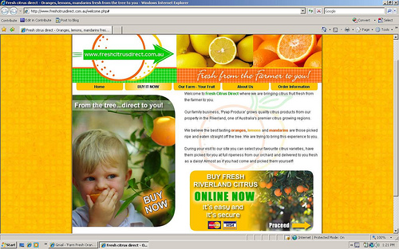
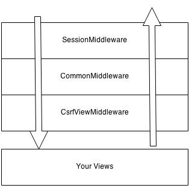

# Django Unchained

---

# About Me

Douglas Mendizábal

* OpenStack Developer - [https://launchpad.net/~dougmendizabal](https://launchpad.net/~dougmendizabal)

    * Core Developer for Barbican

* IRC - redrobot on freenode

* Twitter - [@elrobotrojo](https://twitter.com/elrobotrojo)

* GitHub - [https://github.com/dmend](https://github.com/dmend)

---

# [http://goo.gl/vF1UUz](http://goo.gl/vF1UUz)

---

# Web Development

How do you make a website?

---

# HTML

    !html
    <!DOCTYPE html>
    <html lang="en">
        <head>
            <title>My first webpage</title>
            <link rel="stylesheet" href="style.css">
        </head>
        <body>
            <h1>Hello World!</h1>
            
        </body>
    </html>

---

# CSS

    !css
    h1 {
        font-family: Helvetica, Arial, sans-serif;
        font-size: 2em;
        font-weight: bold;
    }

---

# JavaScript

    !javascript
    (function(){
        var hello = "Hello World!";
        alert(hello);
    })();

---

# Why do I need Django?

---

# How can I serve you?

* Register a domain (.com, .net, .bike, .tattoo, etc)
* Configure your web server (Apache, Nginx, etc.) to serve a directory
* Point DNS to your Server IP

---

# Static Website - stuffstore.com

    !bash
    $ tree
    /var/www/html
    .
    ├── about.html
    ├── index.html
    └── products
        ├── invisible_clothes.html
        ├── red_shoes.html
        └── rubber_chickens.html

URLs

    http://stuffstore.com/about.html
    http://stuffstore.com/index.html
    http://stuffstore.com/products/invisible_clothes.html
    http://stuffstore.com/products/red_shoes.html
    http://stuffstore.com/products/rubber_chickens.html

---

# How to deal with thousands of pages?

* Make only one page, then use a database to fill in the blanks

---

# Django

“Django is a high-level Python Web Framework that encourages rapid development and clean, pragmatic design.”

* [https://www.djangoproject.com/](https://www.djangoproject.com/)

    

## “Elegant URL design”
* [Cool URIs don’t change!](http://www.w3.org/Provider/Style/URI.html)
*  Uses regular expressions for url matching

---

# Django

## Everything AND the Kitchen Sink!

* Built-in ORM
    * SQL: Postgres, MySQL, SQLite, etc.
* Admin Interface
* Authentication Framework
* Development Web Server

---

# Projects and Apps, oh my!

* Projects - Python package that contains all the settings for an instance
    of django.

* Apps - Web application that does someting. e.g. A blog, an bulletin board,
    database of public records, etc.

---

# It’s not MVC, it’s…

* Models
* Templates (Views)
* Views (Controllers)

---

# Request Handling

* Request is handled by the server
* Django uses URL configuration to route the request to the view
* View takes a request, and renders an appropriate response

Can be extended with __Middleware__

* Authentication/Authorization
* Caching
* CSRF protection

---

# Django

---

# Middleware

* Handles pre-processing and post-processing of request

---

# Installing Django

Latest version 2.0.6 released on June 1, 2018

    !bash
    $ pipenv install django

---

# Begin a new project

    !bash
    $ django-admin.py startproject bookstore

    $ tree bookstore
    bookstore
    ├── bookstore
    │   ├── __init__.py
    │   ├── settings.py
    │   ├── urls.py
    │   └── wsgi.py
    └── manage.py

---

# Start the development web server

    !bash
    $ python manage.py runserver

Go to [http://localhost:8000](http://localhost:8000)

---

# Add your first app

    !bash
    $ python manage.py startapp inventory

    $ tree
    .
    ├── bookstore
    │   ├── __init__.py
    │   ├── settings.py
    │   ├── urls.py
    │   └── wsgi.py
    ├── inventory
    │   ├── __init__.py
    │   ├── admin.py
    │   ├── migrations
    │   │   └── __init__.py
    │   ├── models.py
    │   ├── tests.py
    │   └── views.py
    └── manage.py
---

# Include your new app in the project

* Add app "inventory" to INSTALLED_APPS in bookstore/bookstore/settings.py

        !python
        INSTALLED_APPS = (
            'django.contrib.admin',
            'django.contrib.auth',
            'django.contrib.contenttypes',
            'django.contrib.sessions',
            'django.contrib.messages',
            'django.contrib.staticfiles',
            'inventory',
        )

---

# URLConf

* Where you define the mapping of URLs to Views
* Uses Regular Expressions for URL matching
* Can use Regular Expression groups to capture data from url and pass into your view as a parameter

        !python
        from django.conf.urls import patterns, include, url
        from django.contrib import admin

        urlpatterns = patterns('',
            # Examples:
            # url(r'^$', 'bookstore.views.home', name='home'),
            # url(r'^blog/', include('blog.urls')),

            url(r'^$', 'inventory.views.home'),

            url(r'^admin/', include(admin.site.urls)),
        )
---

# Intro to Views

# View Functions

* A view is a Python function that takes a Web request and returns a Web response

		!python
        from django.http import HttpResponse
        from django.shortcuts import render

        # Create your views here.

        def home(request):
            return HttpResponse(
                '<html><body><h1>Django Unchained!</h1></body></html>'
            )

---

# Models

* Each model is a Python class that subclasses django.db.models.Model
* Each class attribute of the model represents a database field

        !python
        from django.db import models

        # Create your models here.

        class Author(models.Model):
            first_name = models.CharField(max_length=256)
            last_name = models.CharField(max_length=256)

        class Book(models.Model):
            author = models.ForeignKey(Author)
            title = models.CharField(max_length=256)
            release_date = models.DateField(null=True)
            isbn = models.CharField(max_length=13)
            list_price = models.DecimalField(max_digits=8, decimal_places=2)
            on_hand = models.IntegerField(default=0)

---

# Create Database Schema

* Django inspects your models.py module to figure out the database changes

        !bash
        $ python manage.py makemigrations
        $ python manage.py migrate

* Adds a SQLite database by default (db.sqlite3)

---

# Django ORM

* Let's add some Authors to our database

        !python
        $ python manage.py shell

        >>> from inventory.models import *

        >>> twain = Author(first_name='Mark', last_name='Twain')
        >>> twain.save()

        >>> chuck = Author.objects.create(
        ...     first_name='Chuck',
        ...     last_name='Palahniuk')

---

# Django ORM

* Add some Books

        >>> b = Book(title='The adventures of Tom Sawyer'
        ...     list_price=9.99)
        >>> b.author = mark
        >>> b.save()

		>>> Book.objects.create(title='Fight Club',
                                author=chuck,
                                list_price=6.99)
        <Book: Book object>
		>>> Book.objects.all()
		[<Book: Book object>, <Book: Book object>]

---

# Security - SQL Injection

* By using the Django ORM you get protection from SQL Injection for free!
* Values sent to the ORM are escaped based on your database backend
* You can execute raw SQL if you need to

		!python
		>>> Book.objects.raw('SELECT * FROM myapp_book')

[1]

---

# URLConf Revisited

    !python
    # http://localhost:8000/books/ISBN
    url(r'^books/(\d+)/$', 'inventory.views.detail'),

---

# View Functions

    !python
    from django.http import HttpResponse, Http404

    from inventory.models import Book

    def detail(request, isbn):
        matches = Book.objects.filter(isbn__exact=isbn)
        if not matches:
            raise Http404
        else:
            book = matches[0]

        return render(request, 'detail.html', {'book': book})

---

# Templates

* Django’s template engine provides a powerful mini-language for defining the user-facing layer of your application

		!html
		<!DOCTYPE html>
		<html>
		<head>
			<title>Book Detail</title>
		</head>
		<body>
            
		    <h1>{{ book.title }}</h1>
            
		        
Released on  {{ book.release_date }}.

            
            
		</body>
		</html>

Not limited to HTML

---

# Templates

* Templates are reusable

        !python
        

        Django Bookstore

        
          

            <h1>{{ book.title }}</h1>
            <h2>by {{ book.author.first_name }} {{ book.author.last_name }}</h2>
            
              
Released on {{ book.release_date }}

            
          

        

---

# Security - Cross Site Scripting (XSS)

* All variables output by the template engine are escaped
* Django provides a ‘safe’ filter to bypass protection if you need to

		!python
		{{ name|safe }}

---

# Forms

* First, let's add a new model to hold form data

        !python
        class Order(models.Model):
            first_name = models.CharField(max_length=256)
            last_name = models.CharField(max_length=256)
            email = models.EmailField()
            book = models.ForeignKey(Book)
            quantity = models.IntegerField(default=1)

        $ python manage.py makemigrations
        $ python manage.py migrate

---

# Make a form class

    !python
    from django import forms

    from django import forms
    from inventory import models

    class OrderForm(forms.Form):
        first_name = forms.CharField(max_length=256)
        last_name = forms.CharField(max_length=256)
        email = forms.EmailField()
        book = forms.ModelChoiceField(queryset=models.Book.objects.all())
        quantity = forms.IntegerField()

---

# Use form in a view function

    !python
    def contact(request):
        if request.method == 'POST':
            form = BookOrderForm(request.POST)
            if form.is_valid():
                # Process form data
                # ...
                return HttpResponseRedirect('/thanks/')
        else:
            form = BookOrderForm()

        return render(request, 'contact.html', {
                'form': form,
        })

---

# Use from in a template

    !html
    <form action="/order/" method="post">
        
        {{ form.as_p }}
        <input type="submit" value="Submit" />
    </form>

---

# Security - Cross Site Request Forgery

* Easy to use
* Not on by default
* Ensure middleware is enabled

		!python
		'django.middleware.csrf.CsrfViewMiddleware'

* In any template that uses a POST form use

		!python
		<form action="." method="post">
			

* Use `render` which will us a RequestContext for you

        !python
        render(request, template)

---

# Admin

    !python
    $ python manage.py createsuperuser

---

# Add models to Admin

    !python
    from inventory import models

    admin.site.register(models.Book)
    admin.site.register(models.Author)
    admin.site.register(models.Order)

---

# Questions?

---

# Resources

Django Docs - [https://docs.djangoproject.com](https://docs.djangoproject.com)

OWASP Top 10 - [https://www.owasp.org/index.php/Top10](https://www.owasp.org/index.php/Top10)

---

# Credits

## Photos
[1] CC-BY https://www.flickr.com/photos/nathanf/2196764544
