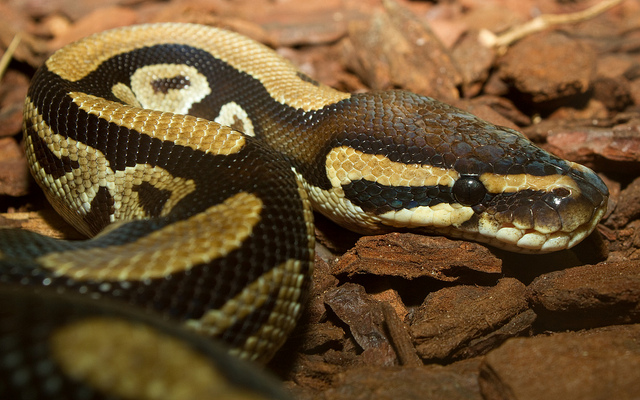
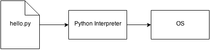
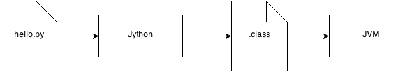

# Snake Charming with pyenv

---

# About Me

## Douglas Mendizábal

* OpenStack Developer at Rackspace

    * OpenStack Barbican - http://github.com/openstack/barbican

* IRC - redrobot on Freenode

* Twitter - @elrobotrojo

* GitHub - http://github.com/dmend

---

# Snakes

---

# Snakes

## Python the language

    !python
    print("Hello World! \U0001F37A")

## Python the software

    $ python hello.py

---

# Python Language

* Syntax and semantics

    * Specification - [https://docs.python.org/3/reference/index.html](https://docs.python.org/3/reference/index.html)
    * Type System
    * Reserved Words
    * Statements and expressions

* Python 2.7

* Python 3.4

---

# Python Interpreter

Software

    !bash
    $ python hello.py
    Hello World!

    $ python
    Python 3.4.1 (default, Jun  5 2014, 10:35:58)
    [GCC 4.2.1 Compatible Apple LLVM 5.1 (clang-503.0.40)] on darwin
    Type "help", "copyright", "credits" or "license" for more information.
    >>>

---

# CPython

* Reference Implementation
    * [https://www.python.org/downloads/](https://www.python.org/downloads/)
* Written in C
* Python 3.4.1
* Python 2.7.8
* Python 2.6.x (Centos 6)

---

# PyPy

* Python written in Python
* FAST! - Faster than CPython
* PyPy 2.4.0 (Python 2.7)
* PyPy3 2.3.1 (Python 3.2)

---

# Jython

* Python on the JVM

* Jython 2.5.3
* Jython 2.7beta3

---

# Others

* Stackless Python
    - Multithreaded version Python

* IronPython
    - Python for .NET

---

# Snake Charming

---

# pyenv

* Fork of rbenv maintained by Yuu Yamashita

* [https://github.com/yyuu/pyenv](https://github.com/yyuu/pyenv)
* Uses __shims__ to manage many versions of different interpreters
* Lets you change the global Python version on a per-user basis
* Provides support for per-project Python versions
* Allows you to override the python version by setting an Environment Variable

---

# There's a shim in my PATH

    !bash
    $ echo $PATH
    /usr/bin:/bin:/usr/sbin:/sbin:/usr/local/bin

    # use pyenv first
    $ echo $PATH
    ~/.pyenv/shims:~/.pyenv/bin:/usr/bin:/bin:/usr/sbin:/sbin:/usr/local/bin

---

# Choosing the python version

1. PYENV_VERSION enviornment variable (pyenv shell)
2. .python-version file in current directory (pyenv local)
3. .python-version file in parent directory, recursively, up to /
4. ~/.pyenv/version file (pyenv global)

---

# I got my (re)hash pipe

pyenv does not automatically create shims for new executables after installation

# pyenv rehash

---

# Extensible

* pyenv-virtualenv
    - Allows you to create virtual environments for any installed version
    - Treats venvs just like another version

---

# Demo

---

# Questions

